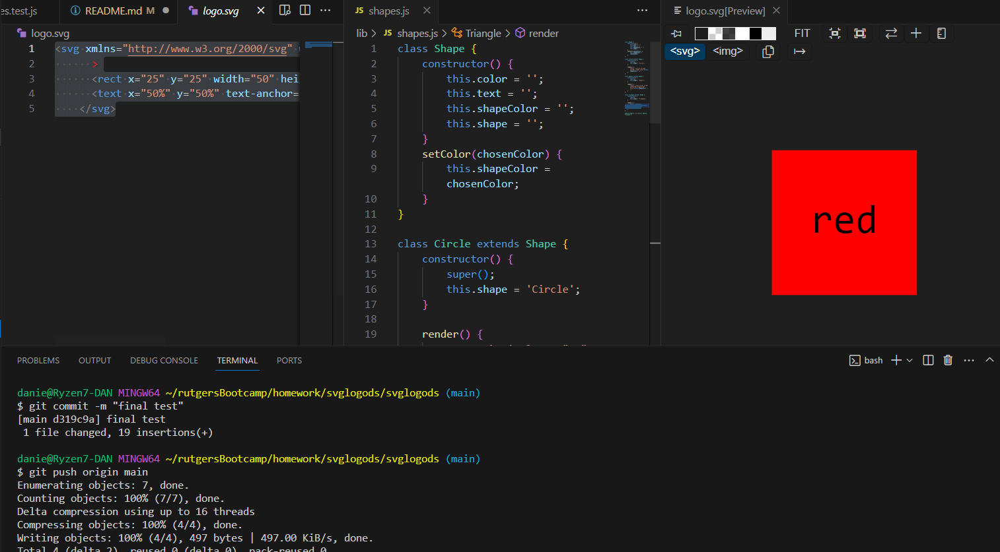

# SVG Logo Maker

## Table of Contents

Installation

Usage

Walkthrough Video

Additional Requirements

Technologies Used

Contributing

License

## Installation

To install the necessary dependencies, run the following command:

npm install inquirer@8.2.4

## Usage

To run the application, use the following command:

node index.js

The application will prompt you to select a color and shape for your logo, and then enter the text you want to include. Once you have provided all the necessary information, the application will generate an SVG file with your logo.

## Additional Requirements

This challenge requires the use of Jest for running unit tests and Inquirer for collecting user input. Make sure to install Jest by running npm install jest and Inquirer by running npm install inquirer.

## Technologies Used

Node.js

Inquirer

Jest

## Contributing

Contributions are welcome! If you have any suggestions or improvements, please submit a pull request.

## License

This project is licensed under the MIT License.

[Link](https://dann9109.github.io/svglogods/)

[Video Link](https://drive.google.com/file/d/156o-IYL-k9zRA19P0W_dCJilC0wAYSfD/view)